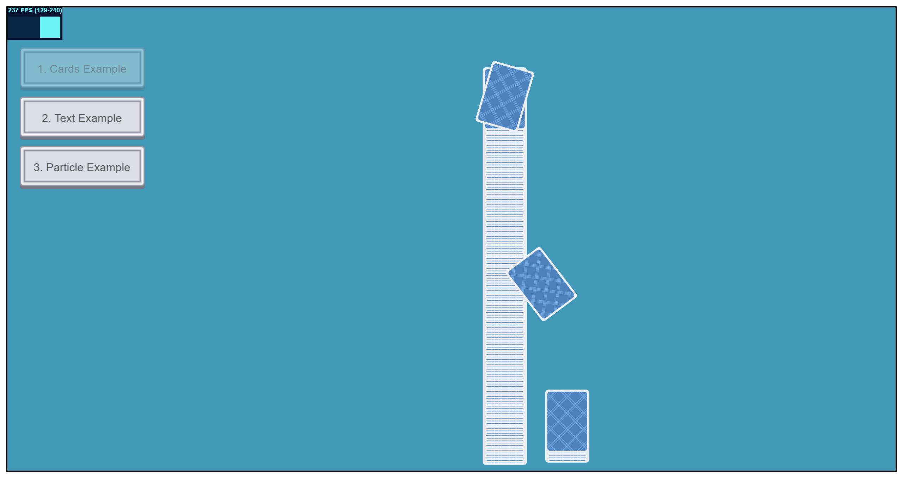

# PixiJS Html5 Examples

This repo includes PixiJS Html5 examples. Enjoy!

This repo forked from the fantastic [pixijs-project-template](https://github.com/SamuelAsherRivello/pixijs-project-template), created by Samuel Asher Rivello, which is a recommended starting point for new projects using [PixiJS](https://pixijs.com/) and [TypeScript](https://www.typescriptlang.org/).

<figure>
    
    <figcaption>Image 1 - PixiJS Game Engine - Html5 + WebGPU</figcaption>
</figure>

### Table of Contents

1. [Getting Started](#getting-started)
1. [Project Overview](#project-overview)
1. [Credits](#credits)

 

# Getting Started

### The Examples

| 1. Cards       | 2. Text       | 3. Particles       |
|---------------|---------------|---------------|
|  |  |  |

### Play The Examples

1. Open [pixijs-html5-examples](https://samuelasherrivello.itch.io/pixijs-html5-examples)
1. Click `Run game` button (center)
1. Click `Fullscreen` button (lower-right)
1. Click `Escape` key to quit
1. Enjoy !

### Build The Examples

1. Download this repo (*.zip or *.git)
1. Install dependencies. Open the `PixiJS` folder in command line...
    * Run `npm install` to download and install dependencies
1. Build the game. Open the `PixiJS` folder in command line...
    * Run `npm run build` builds the game
    * Run `npm start` launches a server to localhost
1. Play the game at [localhost:3000](http://localhost:3000)
1. Open the `PixiJS` folder in [Visual Studio Code](https://code.visualstudio.com/) or your favorite editor 
1. Do your game development
1. Optional: When you add/update files within the `PixiJS` you may need to repeat step 3. See [Webpack Beginner's Guide](https://medium.com/javascript-training/beginner-s-guide-to-webpack-b1f1a3638460) for more info
1. Enjoy !

 

# Project Overview

**Documentation**
* `ReadMe.md` - The primary documentation for this repo
* `PixiJS/documentation/` - More info specific to the project

**Configuration**
* `Game Engine` - [PixiJS](https://www.pixijs.com/) is a flexible and fast 2D rendering library for web-based graphics and games

**Structure**
* `PixiJS` - Contains the main project folder
* `PixiJS/assets/images/.html` - User-facing image assets
* `PixiJS/public/index.html` - The main HTML file for structure
* `PixiJS/src/css/styles.css` - The main CSS file for styling
* `PixiJS/src/scripts/index.ts` - The main TS file for game logic. Do your work here :)

**Dependencies**
* `./PixiJS/package.json` - Lists project dependencies and scripts. When you run `npm install` it installs whatever is here

 

# Credits

**Created By**

- Samuel Asher Rivello 
- Over 25 years XP with game development (2024)
- Over 11 years XP with Unity (2024)

**Contact**

- Twitter - <a href="https://twitter.com/srivello/">@srivello</a>
- Git - <a href="https://github.com/SamuelAsherRivello/">Github.com/SamuelAsherRivello</a>
- Resume & Portfolio - <a href="http://www.SamuelAsherRivello.com">SamuelAsherRivello.com</a>
- LinkedIn - <a href="https://Linkedin.com/in/SamuelAsherRivello">Linkedin.com/in/SamuelAsherRivello</a> <--- Say Hello! :)

**License**

Provided as-is under MIT License | Copyright © 2024 Rivello Multimedia Consulting, LLC